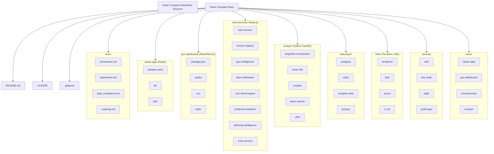

# 🇦🇪 Aman Compass – UAE Civic Intelligence & Early Warning Platform

[](https://opensource.org/licenses/MIT)
[](https://github.com/gebetasuq/aman-compass/pulls)


**Aman Compass** is a dual‑layer digital infrastructure that empowers citizens with AI‑driven government services and crisis response tools, while providing government authorities with real‑time, anonymized civic intelligence and early‑warning capabilities. Designed to enhance national resilience across all seven emirates, the platform is fully PDPL‑compliant and built with privacy by design 

##  Overview

Aman Compass combines two powerful layers:

 **Citizen‑Facing Application** – A Flutter‑based mobile app offering personalized guidance, service discovery, emergency preparedness, SME compliance support, cyber hygiene, and crisis reporting (including real‑time alerts, shelter locators, and an SOS button).
 **Government Intelligence Dashboard** – A secure web portal that visualizes anonymized civic signals (search trends, service pressure, confusion heatmaps, phishing clusters, and crisis indicators) and provides predictive analytics for proactive governance.

The platform is built with privacy by design: all citizen data is anonymized via a differential privacy engine before aggregation, fully complying with UAE PDPL and international data protection standards.


##  Key Features

###  Citizen App
- **Emirate Context Engine** – Personalization for each of the 7 emirates.
- **5 Intelligence Pillars**: Civic Navigator, SME Companion, Cyber Trainer, Aman Preparedness, Data Explorer.
- **AI‑Powered Civic Assistant** – RAG‑based guidance in Arabic & English.
- **Offline Mode & Smart Caching** – Use critical features without internet.
- **Phishing & Scam Reporting** – Submit SMS, URLs, or screenshots.
- **Crisis Response Module**:
  - Real‑time emergency alerts (push notifications)
  - Offline shelter and hospital locator
  - SOS button with location sharing
  - Evacuation route mapping
  - Multi‑language crisis announcements (Arabic, English, Urdu, Hindi)
- **Accessibility**: Quick exit button, full RTL support, screen reader compatibility.

###  Government Dashboard
- Civic confusion heatmap
- Service pressure index
- Phishing campaign map
- Predictive demand forecasts
- SME compliance risk index
- Emergency early signal tracker
- Crisis impact dashboards (real‑time incident reports)
- Role‑based secure access

###  AI & Intelligence Layer
- LangChain orchestration for RAG queries
- Vector knowledge base (Pinecone) for semantic search
- Azure OpenAI GPT‑4 hosted in **UAE regions** (compliance & low latency)
- Predictive analytics engine (ML forecasting)
- Phishing intelligence engine (AI campaign clustering)
- Asynchronous processing queue for scalability

###  Security & Compliance
- PDPL‑compliant (data minimization, consent, anonymization)
- End‑to‑end encryption (AES‑256 at rest, TLS 1.3 in transit)
- Azure Key Vault for secrets management
- WAF & DDoS protection
- Immutable audit logs
- Differential privacy engine

---

##  Repository Structure

The repository is organized as a monorepo containing all components of the Aman Compass platform.



Each folder contains its own README.md with detailed instructions. See the docs/ directory for high‑level documentation.


 Technology Stack

Layer Technologies
Frontend (Citizen) Flutter, Hive, Firebase (analytics, crashlytics, messaging)
Frontend (Gov) React, Next.js, TypeScript, Chart.js / D3
Backend Services Node.js + Express, PostgreSQL, Redis, JWT
AI & ML Python, FastAPI, LangChain, Pinecone, Azure OpenAI (UAE region), Celery
Data & Analytics Azure Data Lake, Differential Privacy (custom library), PostgreSQL
Infrastructure Azure (UAE regions), AKS, Terraform, GitHub Actions
Security Azure Key Vault, WAF, DDoS Protection, PDPL compliance framework

Getting Started

Prerequisites

· Git
· Flutter SDK (≥3.0)
· Node.js (≥18) + npm/yarn
· Python (≥3.10) + pip
· Docker (optional, for local services)
· Azure account (for deployment) or Firebase (for notifications)

Clone the Repository

```bash
git clone https://github.com/gebetasuq/aman-compass.git
cd aman-compass
```

Quick Start – Citizen App

```bash
cd citizen-app
flutter pub get
flutter run
```

Quick Start – Government Dashboard

```bash
cd ../gov-dashboard
npm install
npm run dev
```

Running Microservices Locally

Each microservice has its own README.md. Example:

```bash
cd ../microservices/auth-service
npm install
cp .env.example .env   # fill in your credentials
npm run dev
```

For complete setup instructions, refer to docs/deployment.md.


Documentation

Document Description
architecture.md Detailed system architecture and component interactions
deployment.md Deployment guide for all layers (local, staging, production)
pdpl_compliance.md PDPL compliance mapping and implementation details
roadmap.md Phased rollout plan including crisis response features

 Roadmap

Phase Timeframe Focus
I – Citizen MVP 0–6 months Core app with 5 pillars, emirate selector, offline cache, basic crisis guidelines
II – Civic Signal 6–12 months Government dashboard MVP, anonymized analytics, shelter locator, push alerts
III – Predictive 12–18 months ML forecasting, automated phishing clustering, SOS feature, NCEMA integration
IV – National 18–24 months Multi‑emirate coverage, full crisis module, evacuation routing, PDPL audit
V – Expansion 24+ months Cross‑government integration, advanced AI, multilingual support

See docs/roadmap.md for detailed deliverables per phase.


 Contributing

We welcome contributions from developers, researchers, and government partners. Please read our contributing guidelines before submitting issues or pull requests.

· Report bugs / suggest features via GitHub Issues
· Translate the app (Arabic/English) – see citizen-app/lib/l10n/
· Submit code improvements via pull requests

---

📄 License

This project is open‑source under the MIT License. See LICENSE for details.


Contact

Mohammed B. Kemal  Founder & Chief Architect
mickymohammed3@gmail.com / gabetares@gmail.com 
https://www.linkedin.com/in/mohammed-b-kemal
https://www.gebetauae.com 
For official partnership inquiries, please use the email above.


Built by a resident for residents. 🇦🇪
Supporting the UAE’s vision for a smarter, safer, and more resilient nation.
